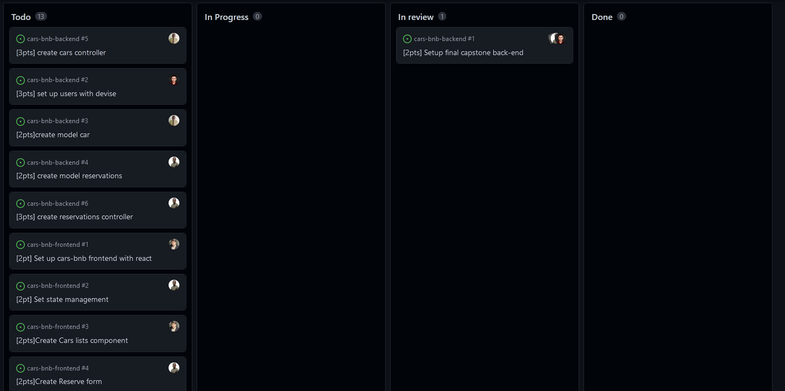

# Cars BnB App

## Welcome! 👋

> #### Cars BnB App
>
> This is a simple app that allows users to rent cars from other users. A user can create a car listing, and other users can rent the car for a specified period of time. The app is built using Ruby on Rails and Bootstrap.
## Screenshots
### Splash Page


## Car Listings

## Reservation Page

## Mobile View


## Back-end App(API)

> [API](https://github.com/Abdo9826/cars-bnb-backend)

## Built With ✔️

- React 🔥
- redux toolkit
- Bootstrap CSS 😋

## Live link 🙌

[LINK](https://63666fbc53628775d8aaf544--stately-tulumba-fce256.netlify.app/)

## Kanban Board 📝
### Initial Planning


## Link to kanban board

[Link to Kanban Board](https://github.com/users/Abdo9826/projects/4/views/1)

## Getting Started 🙌

To get a local copy up and running follow these simple example steps.

### Prerequisites

```
  node js
  npm

```
or 
```
  yarn
```

### Setup

Clone the repository and change the directory to portfolio

```
  `$ git clone https://github.com/Abdo9826/cars-bnb-frontend.git`

  `$ cd cars-bnb-frontend`

```

### Install

Install all project dependencies by running the command below

```
 ` $ npm install` or ` $ yarn install`
```

### Usage

Run

```
  `$ npm start or deploy the index.html from the build/public folder`
  or
  `$ yarn start or deploy the index.html from the build/public folder`
```

### Deployment

- [Visit Application Homepage](#)

### Authors

| 👤 Name         | Github                                   | Twitter                                              | LinkedIn                                                       |
| --------------- | ---------------------------------------- | ---------------------------------------------------- | -------------------------------------------------------------- |
| Robertson Akpan | [@bobb-rob](https://github.com/bobb-rob) | [@\_\_\_Robertson](https://twitter.com/___Robertson) | [@RobertsonAkpan](https://www.linkedin.com/in/robertsonakpan/) |

| 👤 Name | Github                               | Twitter                           | LinkedIn                                   |
| ------- | ------------------------------------ | --------------------------------- | ------------------------------------------ |
| Abdo    | [@abdo](https://github.com/Abdo9826) | [@Abdo](https://twitter.com/Abdo) | [@Abdo](https://www.linkedin.com/in/Abdo/) |

| 👤 Name | Github                               | Twitter                            | LinkedIn                                     |
| ------- | ------------------------------------ | ---------------------------------- | -------------------------------------------- |
| Sigie   | [@ksigei](https://github.com/ksigei) | [@Abdo](https://twitter.com/sigie) | [@sigie](https://www.linkedin.com/in/sigie/) |

| 👤 Name       | Github                                     | Twitter                                | LinkedIn                                         |
| ------------- | ------------------------------------------ | -------------------------------------- | ------------------------------------------------ |
| Shahnawaz Ali | [@Shahnawaz](https://github.com/Shahnawaz) | [@Abdo](https://twitter.com/Shahnawaz) | [@sigie](https://www.linkedin.com/in/Shahnawaz/) |

## 🤝 Contributing

Contributions, issues, and feature requests are welcome!

## Show your support

Give a ⭐️ if you like this project!

## Acknowledgments

- Hat tip to Microverse team for inspiring this project.
- Hat tip to anyone whose code was used
- Hat tip to [Murat Korkmaz](https://www.behance.net/gallery/26425031/Vespa-Responsive-Redesign) for the design inspiration

## 📝 License

All rights reserved.
